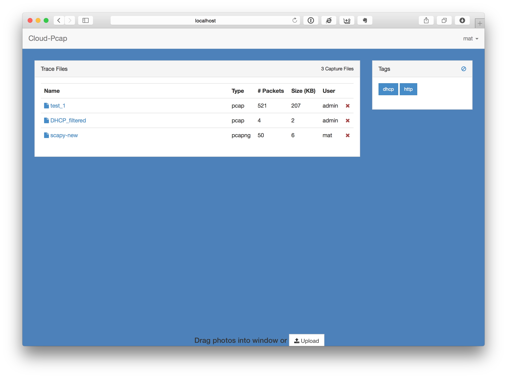
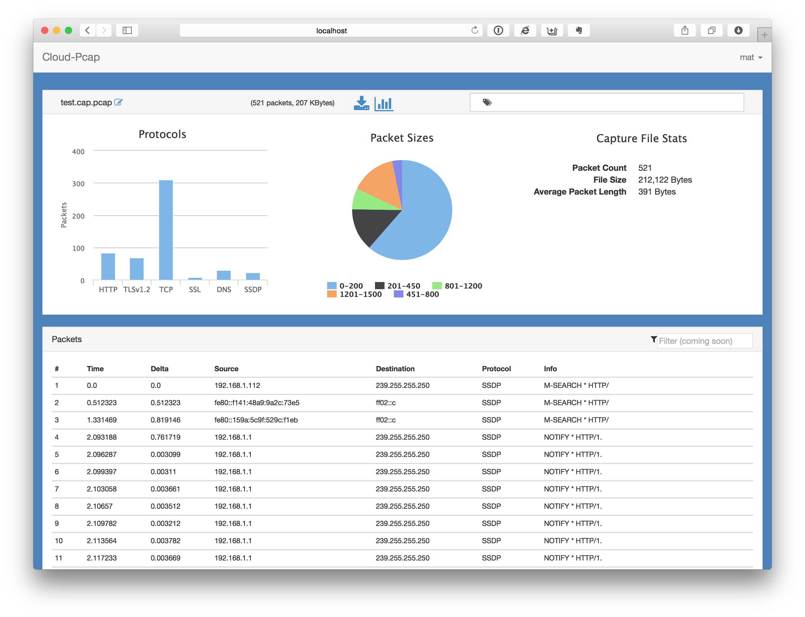
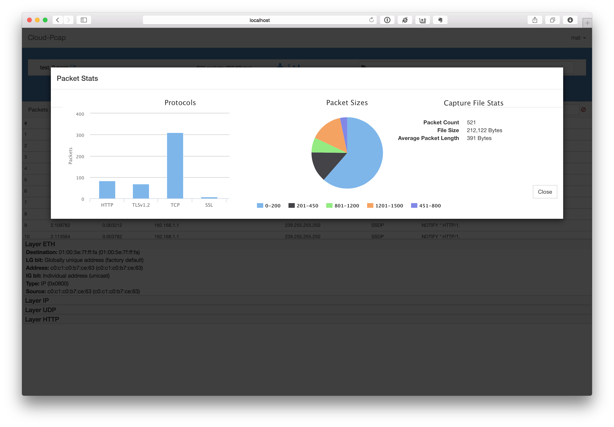

## Cloud-PCAP

A charmingly pathetic knock-off of cloudshark.org that I use for simple cloud pcap storage and very lightweight packet analysis.

## Features

* Easy PCAP uploads
	* Drag & drop on home page
	* Via API (curl, ajax, Wireshark plugins)
* User management
    * PCAPs stored/accessed per user (no sharing yet)
    * Temp password upon account creation
* Packet Overview
    * Capture summary stats
    * [Display Filters](http://wiki.wireshark.org/DisplayFilters)
    * Packet header list
    * Click a packet to see more details 

## Installation/Running

### Pre-requisites
- Docker/Docker-compose

### Installation Steps

* `$ git clone https://github.com/thepacketgeek/cloud-pcap.git`
* `$ cd cloud_pcap`
* `$ ./install.sh`

App is now running and `admin` user is now setup (password printed to stdout)

### Updating/Dev/Debug
You can stop the docker containers with:
`$ docker-compose down`

Start them again (without rebuilding) to pickup code changes with:
`$ docker-compose up`

## Screenshots

## Built With...

* [Docker](http://docker.com)
* [Flask](http://flask.pocoo.org)
* [Flask-Bootstrap](http://pythonhosted.org/Flask-Bootstrap/)
* [PyShark](http://kiminewt.github.io/pyshark/)
* [Chartkick](https://github.com/mher/chartkick.py)
* [Highcharts](http://api.highcharts.com/highcharts)
* [Bootstrap-Taginput](http://timschlechter.github.io/bootstrap-tagsinput/examples/)
* [Bootstrap3-Typeahead](https://github.com/bassjobsen/Bootstrap-3-Typeahead)

